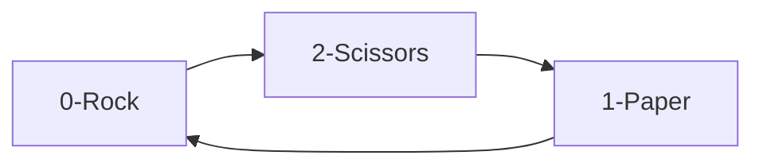

# Rock, Paper, Scissors; 'graphical mode' in terminal

This is a script that visually displays the Rock, Paper, Scissors game more or less graphically on the terminal.

To compete with the machine, you will have to enter your selection by keyboard, and you will automatically obtain the result of confronting your selection with that of the machine (chosen at random).

## Chalenges

The first challenge is to draw the hands facing each other with their corresponding selection (rock, paper, scissors), right on the same line, and to achieve an effect in which the hand on the left has the palm facing upwards, and the hand on the right has the palm facing downwards.


The key to solving this has been the following two items:
1.- Divide the drawing ascci by lines and each line will correspond to an element of a list. So that when drawing both hands, the lines are drawn by concatenating them. Also for the right hand (selection of the machine) when printing, the chains are inverted and the '(' is changed by ')' to give the sensation of turning the hand downwards.
2.- The second self-imposed challenge has been to solve the game of rock, paper, scissors in a numerical way, taking into account the following example:



## Usage

```bash
python3 rock-paper-scissors.py
```

## Config

You can change your death's age in line 10, in 'years-to-live=70' change 70 to the age at which you would prefer to die.

## Credits