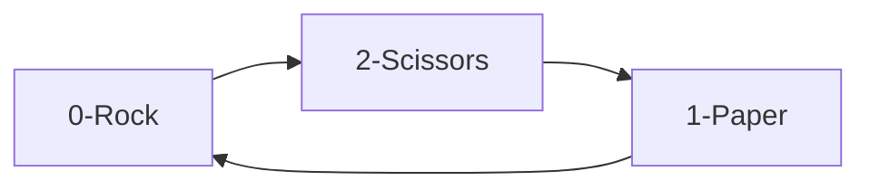

# Rock, Paper, Scissors; 'graphical mode' in terminal

This is a script that visually displays the Rock, Paper, Scissors game more or less graphically on the terminal.

To compete with the machine, you will have to enter your selection by keyboard, and you will automatically obtain the result of confronting your selection with that of the machine (chosen at random).


## Chalenges

The first challenge is to draw the hands facing each other with their corresponding selection (rock, paper, scissors), right on the same line, and to achieve an effect in which the hand on the left has the palm facing upwards, and the hand on the right has the palm facing downwards.

The key to solving this has been divide the drawing ascci by lines and each line will correspond to an element of a list. So that when drawing both hands, the lines are drawn by concatenating them. Also for the right hand (selection of the machine) when printing, the chains are inverted and the ')' is changed by '(' to give the sensation of turning the hand downwards.

```python   
for l in range(len(ROCK)):
    print((left_hand[l] 
    + "|"
    + right_hand[l][::-1].replace(')','(')).center(53))
```

The second self-imposed challenge has been to solve the game of rock, paper, scissors in a numerical way, taking into account the following example:


So if your choice is on the left, and the position of the elements is rock = 0, paper = 1 and scissors = 2;

- If you take out rock(0) and the machine scissors(2):
    - 0 - 2 = -2 (you win)
- If you draw rock(0) and the machine paper(1):
    - 0 - 1 = -1 (you lose)
- If you take out rock(0) and the machine rock(0) too:
    - 0 - 0 = 0 (tie)
---
- If you take out paper(1) and the rock(0) machine:
    - 1 - 0 = 1 (you win)
- If you draw paper(1) and the machine scissors(2):
    - 1 - 2 = -1 (you lose)
- If you draw paper(1) and the machine paper(1):
    - 1 - 1 = 0 (tie)
---
- If you draw scissors(2) and the machine rock(0):
    - 2 - 0 = 2 (you lose)
- If you draw scissors(2) and the machine paper(1):
    - 2 - 1 = 1 (you win)
- If you draw scissors(2) and the machine scissors(2):
    - 2 -2 = 0 (tie)

Therefore, to sum up, you have that:

- For -2 and 1 --> YOU WIN.
- For -1, 2   --> YOU LOSE.
- For 0   --> TIE.

And this sums up the logic of the rock-paper-scissors game in numerical form:

```python
if player - machine == 0:
    print("»" + "It's a TIE!!!!!".center(51) + "«")
elif player - machine == -1 or player - machine == 2:
    print("»" + "YOU LOSE!!!!".center(51) + "«")
elif player - machine == 1 or player - machine == -2:
    print("»" + "YOU WIN!!!".center(51) + "«")   
```

## Usage

```bash
python3 rock-paper-scissors.py
```

## Credits
The ascii drawings in the left-right direction are taken from:
https://gist.github.com/wynand1004/b5c521ea8392e9c6bfe101b025c39abe